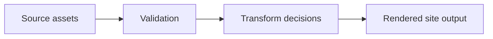

# Image Pipeline

This page demonstrates the kind of long-form technical note that benefits from a sticky table of contents.

## Why it matters

A publishing pipeline touches storage, transforms, and output quality all at once.

> [!NOTE]
> Rustipo does not yet include built-in resize helpers, but it already supports image authoring ergonomics and page-level structure for notes like this one.

## Signals and throughput

If each image contains $w \times h$ pixels and each pixel stores $c$ channels, then the raw sample count is:

$$
S = w \times h \times c
$$

That is a useful sanity check before adding any transformation work.

## Processing stages

## What to document

- the source asset policy
- when transforms happen
- where generated files land
- how themes reference the final files

## Related reading

- [Color spaces](/notes/color-spaces/)
- [Publishing checklist](/guides/publishing-checklist/)
